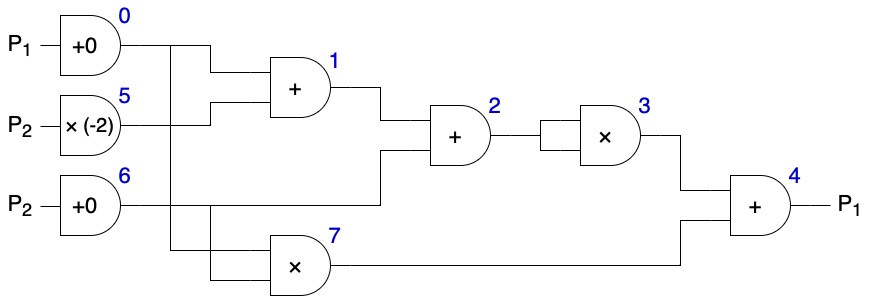

# Beaver :beaver:

A Rust implementation of Beaver's MPC protocol for secure evaluation of arithmetic circuits. A detailed description of the protocol and its security properties can be found in D. Boneh and V. Shoup's book [A Graduate Course in Applied Cryptography](http://toc.cryptobook.us) (as of version 0.6, in section 23.2).

> **Important disclaimer: For many reasons (among others: parameter size, limited testing and lack of external revision) the project is *completely unsuitable for use in real-world cryptographic applications*. Its purposes are purely illustrative.**

## Description

An arithmetic circuit consists of a (cycle-free) network of addition and multiplication gates.
In our case of interest, two parties $P_1$ and $P_2$ would like to evaluate the circuit (modulo some prime $q$), with each of them providing some of its inputs, such that at the end only the designated party/parties (which can be either, both or neither party) learn each of the circuit's outputs.
They do so with the help of a third entity, the dealer, which helps by generating random *sharings* during a set-up phase.

This implementation includes two versions of the protocol:
- The **unauthenticated** version is secure against *honest-but-curious* adversaries. 
This means each party obtains the outputs assigned to it but learns nothing about the inputs provided by the other party or the inputs assigned to the other party - except for the information intrinsically contained in the outputs it obtains.
The dealer does not learn anything about any inputs or outputs either.
- The **authenticated** version is secure against *malicious* adversaries.
That is, in addition to the above guarantees, each party can detect whether the dealer or the other party have tampered with their part of the data, in which case it will choose to abort.
A consequence of this is *soundness*: if a party executes the protocol to the end and receives an output, that value is indeed correct with overwhelming probability.

The details of the protocol can be found in the aforementioned book.

The present implementation simulates the two parties and dealer as three separate threads which communicate only through messages as defined by the protocol - analogously to how they would operate if they were genuinely running in separate machines and communicating through some secure channel.

## Usage

After compiling (for instance, with `cargo build`), the executable can be run with
> `<exec_path> <input_path> <output_path>`

where:
- `<exec_path>` is the path to the executable, usually `./target/debug/beaver` from the main cargo directory.
- `<input_path>` is the path containing the input file, which encodes the circuit and other data as specified in the section [Input file structure](#input-file-structure) below. A few example input files are included in the `example_inputs` folder.
- `<output_path>` is a partial path for the output logs. The programme will create three files: `<output_path>_dealer.txt`, `<output_path>_p1.txt` and `<output_path>_p2.txt`.

The aforementioned logs contain a record of the data received and sent by the corresponding party or the dealer.
One can thus get a feel for how the protocol provides secrecy.
If an error is encountered during the process, it will be printed to `stderr`. Furthermore, if any party aborts (because it detects the other one has tampered with the data), it will record this in its own log as well as `stderr`. This will usually cause the other party to abort too. Additionally, a corrupt party will inform whenever it tampers with the data, both in its own log and `stdout`.

If the protocol is executed successfully (i.e. without either party aborting), the last lines of the protocol will contain whatever outputs it was assigned to receive.

### Input file structure

Input files are plain text files encoding the circuit, input data and output assignment data.
Examples can be found in the `examples_inputs` folder. An input file must contain the following elements in order:

1. An encoding of the circuit, which can be freely split along any number of (non-blank) lines. Line breaks aside, the structure of this encoding is as follows:
    > `<gates> & <outputs_for_p1> & <outputs_for_p2>`

    where
    * `<gates>` is of the form
        > `<gate_1> | <gate_2> | ... | <gate_n>`

        Each gate `<gate_i>`, in turn, has the following structure:
        > `<id>, <input_1>, <op>, <input_2>`

        Here:
        * `<id>` is a `u32` which uniquely identifies the gate in the circuit. These identifiers do not have to be in order, form a continuous numbering or describe in any way the evaluation order of the gates.
        * `<input_1>` must be either `P1`, `P2` or a `u32` value. The first two cases indicate that the input in question must be provided by $P_1$ or $P_2$, respectively (see below). In the third case, the value value must be the identifier of another gate in the circuit. Note that the output of a single gate can act as input to more than one gate.
        * `<op>` is one of `add`, `mul`, `addc` or `mulc`. These refer to addition and multiplication by another input (first two, respectively) or a predefined constant (second two, respectively).
        * `<input_2>` is of the same form as `<input_1>`, with the caveat that if `<op>` is either `addc` or `mulc`, then `<input_2>` is actually of type `i32` and it contains the value of the desired constant.
    
    * `<outputs_for_p1>` is a list of comma-separated `u32` values indicating the identifiers of the gates whose outputs should be revealed to $P_1$. If none should, this parameter should be the empty string.
    * `<outputs_for_p2>` is analogous to the previous point but refers to outputs for $P_2$.

    **Example:**

    The lines
    ```
    0, P1, addc, 0 |
    1, 0, add, 5 |
    2, 1, add, 6 |
    3, 2, mul, 2 |
    4, 3, add, 7 |
    5, P2, mulc, -2 |
    6, P2, addc, 0 |
    7, 0, mul, 6
    & 4
    &
    ```

    encode the circuit:

     with the blue numbers indicating the identifier of each gate.


2. A blank line indicating the end of the circuit encoding.

3. A line containing a single `u32` value, which designates `q`. This is the prime modulo which the entire circuit arithmetic takes place.

4. A line containing a comma-separated list of `i32` values. These are the actual input values that $P_1$ provides to all gates where it is supposed to provide the **first** input. In other words, these are the inputs for gates of the form `<id>, P1, <op>,  <input_2>` in the circuit encoding. Important: these `i32` values have to be **in ascending order with respect to the identifier of the gate they correspond to**. For instance, if $P_1$ wants to provide the value -5 to the first input of gate with identifier 10 and the value 3 to the first input of the gate with identifier 2, this line should be: `3, -5`

5. A line analogous to the previous one but referring to the gates where $P_1$ provides the **second** input, i.e. gates of the form `<id>, <input_1>, <op>,  P1`

6. A line analogous to point 4 above but corresponding to inputs provided by $P_2$.

7. A line analogous to point 5 above but corresponding to inputs provided by $P_2$.

8. A line containing `true` or `false` indicating whether the protocol execution should be authenticated or not. If `true`, each party will verify that the other one has not tampered with the data using a key generated by the dealer. Note that, even if tampering occurs (which is registered in the log of the corrupt party), detection is not guaranteed - only very likely (and more so the higher `q` becomes).

9. A line containing `true` or `false` indicating whether one of the parties should be corrupt. If so, the programme will randomly choose one of $P_1$ or $P_2$ to be the corrupt party. A corrupt party has a 20% chance of tampering with the data each time it sends data to the other party (this probability is hard-coded as the constant `CORRUPTION_DEGREE` in `src/protocol.rs`, which can be tweaked to taste). Note that, even if a party is corrupt, the other one will not detect so unless the protocol is run in authenticated (see the previous point).

## Important TODOs

- Further testing
- Add verification that the dealer is not corrupt
- Add functionality to simulate corrupt dealer

## Contributing
The repository is currently meant to showcase the code only and is therefore not open to contributors. However, if you find it interesting or there is anything you would like to discuss, feel welcome to message me!
